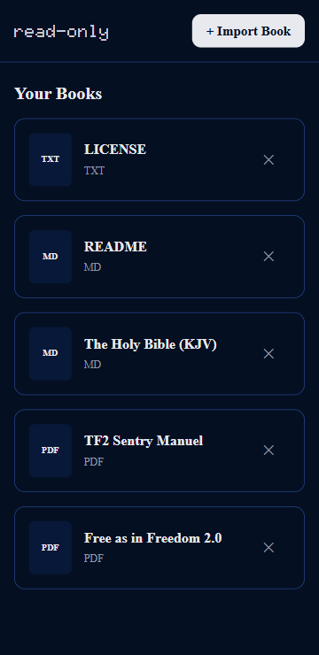
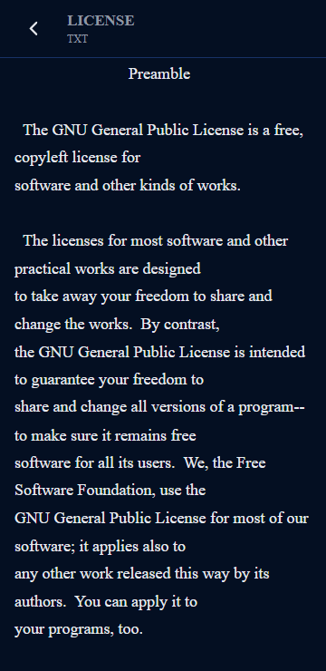
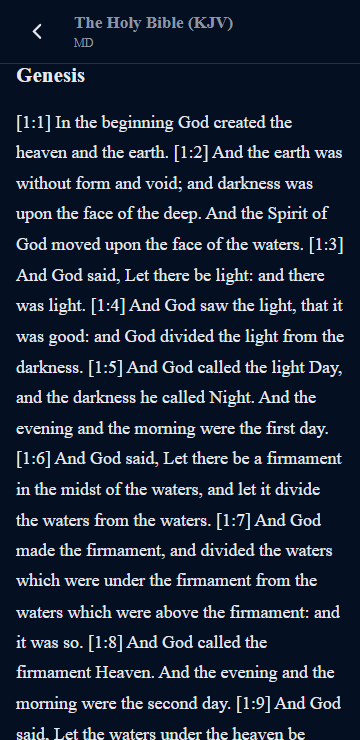
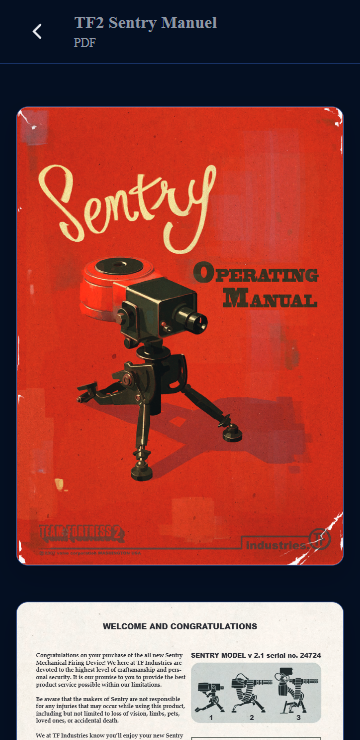

<p align="center">
    
</p>

### The free and open-source reading app for Android that remembers where you left off.
```read-only``` is an app that allows people to import text-based files and read them in a clean, minimal UI, designed for Android.
read-only is a capacitor web-app written in ```HTML, CSS, and Javascript```

# What does it look like?
## Home screen: 



## .TXT:



## Markdown:



## PDF:



## Android App Icon:


